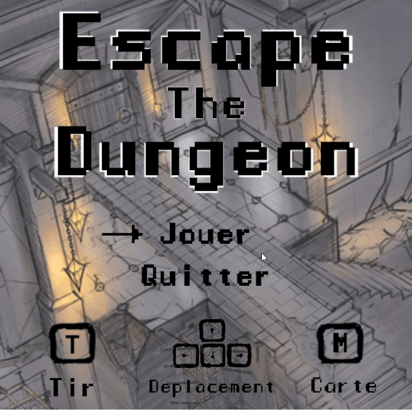

# Escape the dungeon - 2D game Rogue Like project

This game was made as a 3rd year university project, in a team of four developers, using C with SDL2 library.

## Setup 

To start the game, double click on the exe file, located in the Windows executable folder

To play, use the keyboard keys to move, the key T to shoot and the key M to display the map.

## The game

In this game, you have to escape a three floor dungeon, avoiding or killing ennemies along the way. Each floor is randomly generated and you will have to find your way through the maze to succesfully escape. On the way you will have to carefully handle your ammo and life. Each floor increases in difficulty but you also get stronger, has you will be able to find upgrades on your path.

Good luck and have fun !

